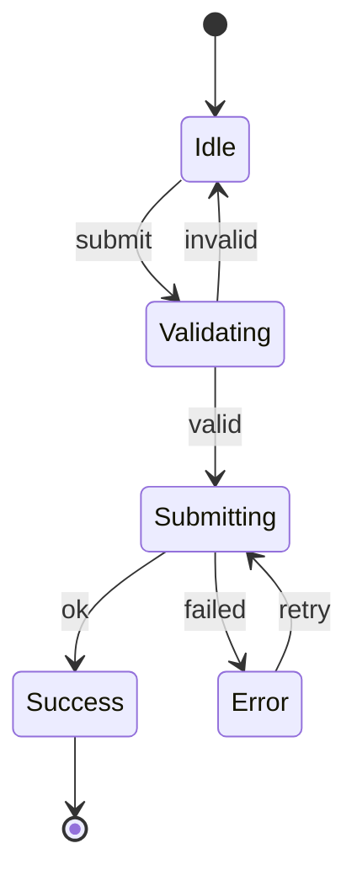

# Documentation

Three modes: **WRITE** (create from scratch), **UPDATE** (sync existing), **STATE_DIAGRAM** (generate state machine diagrams).

## Mode Detection

| User intent | Mode |
|-------------|------|
| "write docs", "create documentation", "document this project", "write a README" | WRITE |
| "update docs", "sync docs", "docs are outdated", "refresh README" | UPDATE |
| "create state diagram", "map states", "visualize state machine", "analyze transitions" | STATE_DIAGRAM |

---

## WRITE and UPDATE Modes

### Step 1: Ask Preferences

**WRITE mode:**

```
AskUserQuestion:
  question: "What documentation scope?"
  header: "Scope"
  options:
    - label: "README only (Recommended)"
      description: "Single comprehensive README with all essential info"
    - label: "README + Architecture diagram"
      description: "README plus visual system overview"
    - label: "Full documentation"
      description: "README, API docs, and Architecture (for complex projects)"
```

If architecture diagram selected, also ask diagram format (see Diagram Format below).

**UPDATE mode:**

```
AskUserQuestion:
  question: "What should the update focus on?"
  header: "Focus"
  options:
    - label: "Full sync (Recommended)"
      description: "Update all outdated sections, add missing features, remove deprecated"
    - label: "New features only"
      description: "Only document features added since last update"
    - label: "Accuracy check"
      description: "Fix incorrect examples and commands, don't add new content"
```

If existing docs have diagrams, ask whether to update them.

### Step 2: Gather Context

**Both modes** -- read project type, dependencies, structure:

```bash
cat package.json 2>/dev/null || cat Cargo.toml 2>/dev/null || cat go.mod 2>/dev/null || cat requirements.txt 2>/dev/null
```

Use Glob `**/*.md` to find existing documentation.

**UPDATE mode additionally** -- check staleness:

```bash
if git rev-parse --git-dir > /dev/null 2>&1; then
  echo "=== Last doc update ==="
  git log -1 --format="%ai %s" -- "*.md"
  echo "=== Last code update ==="
  git log -1 --format="%ai %s" -- "src/" "lib/" "*.ts" "*.js" "*.py" "*.go" "*.rs"
  git log --oneline --since="$(git log -1 --format='%ai' -- '*.md')" -- src/ lib/
fi
```

### Step 3: Write Documentation

**First, load the humanizer skill and apply its patterns to all writing:**
```
Skill: humanizer
```

**Philosophy:**
- **Fewer docs, more depth.** One comprehensive README beats ten scattered files. Consolidate aggressively.
- **Exhaustive but scannable.** Document everything important, structure for quick access.
- **Code is the source of truth.** Read actual code before writing about it.

**README sections (in order):**
1. Title + one-line description
2. Quick start — clone, install, run (copy-paste ready)
3. Architecture — how it works, key concepts
4. API/Usage — how to use it
5. Configuration — env vars, options
6. Development — contribute, test, build
7. Deployment — if applicable

**Writing standards:**
- Be specific: `npm run dev` not "Run the development server"
- Show, don't just tell: full endpoint examples with request/response
- Include the "why": `RATE_LIMIT=100` — requests per minute per IP
- Every API endpoint gets a curl/fetch example
- Every config option shows valid values
- All examples verified against actual code

**UPDATE mode additionally:**
- Keep what's good — don't rewrite working documentation
- Fix what's wrong — correct inaccuracies in-place
- Add what's missing — new features, changed behavior
- Remove what's dead — deprecated features, deleted code

**Anti-patterns:**
- Don't create separate files for content that fits in README
- Don't write vague descriptions without examples
- Don't leave placeholder sections "to be written"
- Don't document every function (that's what JSDoc/docstrings are for)

### Step 4: Verification

```bash
git diff --stat -- "*.md"
wc -l README.md
head -50 README.md
```

### Output

**WRITE:**

| File | Lines | Sections |
|------|-------|----------|
| README.md | N | Quick start, Architecture, API, Config, Development |

**UPDATE:**

| File | Changes |
|------|---------|
| README.md | Added X, Updated Y, Removed Z |

**Added / Updated / Removed** lists as applicable.

### Notes

- Prefer updating existing README over creating new files
- Don't create docs for trivial projects (< 5 source files)
- ASCII diagrams recommended for portability
- If docs are severely outdated (>50% needs rewriting), suggest WRITE mode instead

---

## STATE_DIAGRAM Mode

Generate an exhaustive state machine diagram for a component.

### Step 1: Ask Format Preference

```
AskUserQuestion:
  question: "What format for the state diagram?"
  header: "Format"
  options:
    - label: "ASCII (Recommended)"
      description: "Simple text diagram, works everywhere, no rendering issues"
    - label: "Mermaid"
      description: "Renders in GitHub/docs, but has syntax restrictions"
    - label: "Markdown table"
      description: "Just the states and transitions as a table"
```

### Step 2: Find the Component

If argument is a file path, read directly. If a component name, search for matching files. If ambiguous, ask user to clarify.

### Step 3: Exhaustive Analysis

Read the entire component and trace ALL state. No shortcuts -- the value is exhaustive analysis.

**State sources:**
- `useState` / `useReducer` hooks
- XState machines or similar
- Class component state
- URL parameters / search params
- Form libraries (react-hook-form, formik, etc.)
- Context consumers that affect behavior
- Refs that gate behavior

**For each state variable, document:**
- All possible values
- Initial value
- What triggers changes
- Side effects on change

**Trace all paths:**
- Happy path
- Error paths
- Edge cases (empty, loading, race conditions)
- Recovery paths (retry, reset)

### Step 4: Generate Diagram

#### ASCII

```
[Idle] --submit--> [Validating] --valid--> [Submitting] --success--> [Done]
                        |                       |
                     invalid                  error
                        |                       |
                        v                       v
                     [Idle]                  [Error] --retry--> [Submitting]
```

#### Mermaid



**Mermaid restrictions:** No `=`, `==`, `!=`, `>=`, `<=`, `/`, `()`, `.`, `{}`, or quotes in labels. Use simple words.

#### Table

| State | Trigger | Guard | Next State | Side Effects |
|-------|---------|-------|------------|--------------|
| Idle | submit | -- | Validating | -- |
| Validating | valid | passes rules | Submitting | -- |
| Validating | invalid | fails rules | Idle | show errors |
| Submitting | success | HTTP 200 | Success | redirect |
| Submitting | error | HTTP 4xx/5xx | Error | log |
| Error | retry | -- | Submitting | clear error |

### Step 5: Update Documentation

Update docs in this priority order:

1. **README.md** in component directory or project root -- add/update `## Architecture` section
2. **ARCHITECTURE.md** if it exists -- add/update section for this component
3. **Inline JSDoc** in the component file above the component definition

Do NOT create new documentation files unless no README or ARCHITECTURE.md exists and the component is complex enough to warrant it. Ask before creating new files.

### Step 6: Output Summary

1. The generated diagram (in code block)
2. List of files updated
3. Edge cases or issues discovered during analysis
4. Suggestions if state machine could be simplified

### Quality Checklist

- [ ] Every `useState`/`useReducer` accounted for
- [ ] Every conditional branch mapped
- [ ] Error states and recovery paths included
- [ ] Loading/pending states included
- [ ] Initial and terminal states marked
- [ ] Transition triggers are specific (not just "changes")
- [ ] Existing docs updated (no unnecessary new files)
- [ ] Format matches user preference

---

## Diagram Format (shared)

When any mode needs a diagram format choice:

```
AskUserQuestion:
  question: "What format for diagrams?"
  header: "Diagram"
  options:
    - label: "ASCII (Recommended)"
      description: "Simple text diagram, works everywhere"
    - label: "Mermaid"
      description: "Renders in GitHub/docs, has syntax restrictions"
```
